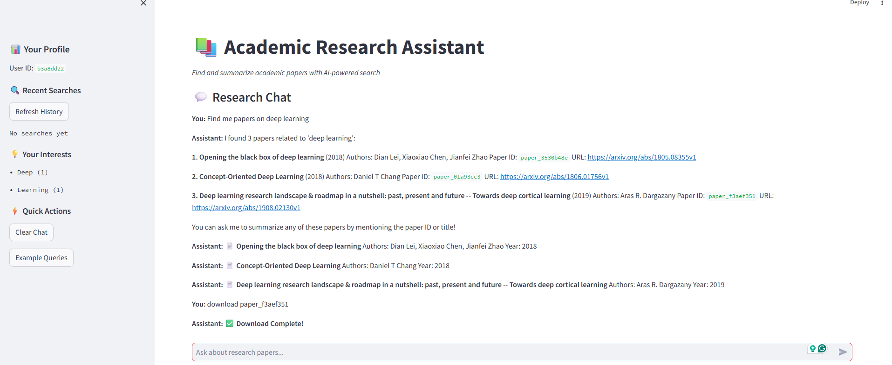

# TutorMate - Academic Research Assistant



A Streamlit-based academic research assistant that helps you find, summarize, and download academic papers using AI-powered search and Google's Gemini API.

## Features

- 🔍 **AI-Powered Paper Search**: Search arXiv for academic papers using natural language
- 📝 **Smart Summaries**: Get concise summaries of papers using Gemini AI
- 📥 **PDF Downloads**: Download papers directly to your local machine
- 💬 **Interactive Chat**: Natural conversation interface for research queries
- 📊 **Search History**: Track your research interests and previous searches

## Quick Start

1. **Install dependencies:**
   ```bash
   pip install -r requirements.txt
   ```

2. **Set up environment variables:**
   Create a `.env` file with:
   ```
   GEMINI_API_KEY=your_gemini_api_key_here
   ```

3. **Run the application:**
   ```bash
   # Start backend
   python main.py
   
   # Start frontend (in another terminal)
   streamlit run app.py
   ```

4. **Access the app:**
   - Frontend: http://localhost:8501
   - Backend API: http://localhost:8000

## Usage

- Search for papers: "Find me papers about federated learning"
- Get summaries: "Summarize the first paper"
- Download PDFs: "Download paper_12345678"
- View history: "Show my previous searches"

## Tech Stack

- **Frontend**: Streamlit
- **Backend**: FastAPI
- **AI**: Google Gemini API
- **Database**: SQLite
- **Paper Source**: arXiv API
